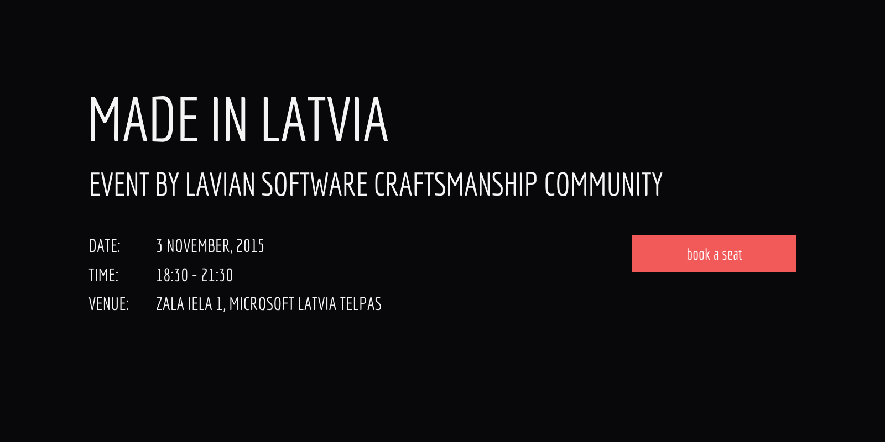
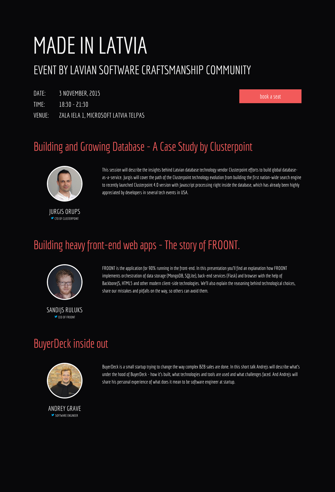
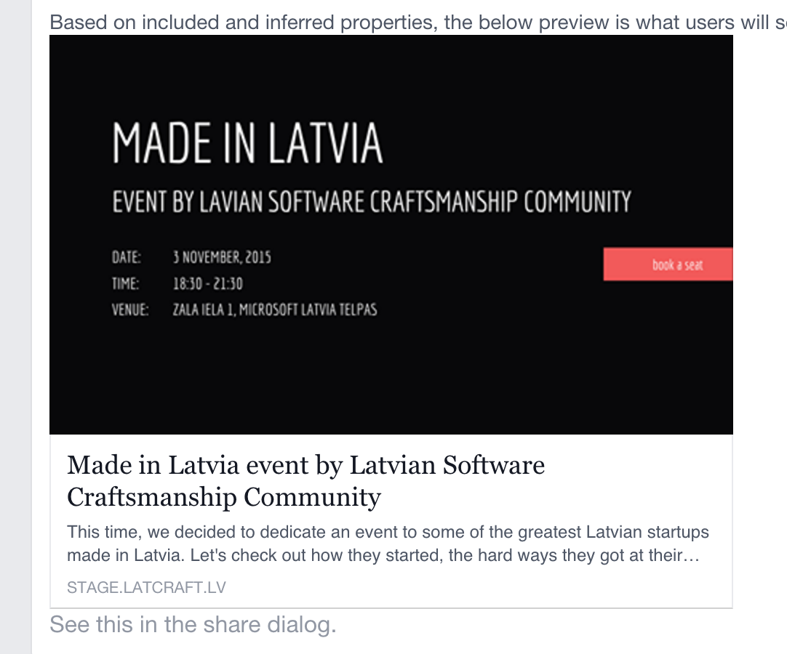

# LatCraft website sources

This repository contains *Gulp* project that builds **LatCraft** website.

# How to build

- Install `PhantomJS`
- Install `ImageMagick` and `GraphicsMagick`
- Install `node.js` from <http://nodejs.org/download/>.
- Install `gulp` by running `npm install gulp -g`.
- Fetch `node.js` modules by running `npm install`.
- Build website by running `gulp build`.
- Or just run `gulp` to start local web server on port 9009 and go to <http://localhost:9009> in your browser. There is also a shortcut to start gulp if you are on Windows. 

> By default website is built for `local` development environment. Adding `--environment stage` or `--environment live` arguments builds the website for `staging` or `production` accordingly.

# How to add new event
- Go to `./data/events.json` and add new JSON record
- Under `./jade/pages/<currentYear>/` create two `.jade` templates with names corresponding to the event name (see examples under `./jade/pages/2015`). For `Made in Latvia` event you will end up with two templates:

```
// madeinlatvia.jade
extends ../../layouts/infograph
block vars
	- var eventDate = '3 November, 2015'
	- var path = '2015/madeinlatvia'
```

```
// madeinlatvia_og.jade
extends ../../layouts/infograph
block vars
	- var openGraph = true
	- var eventDate = '3 November, 2015'
	- var path = '2015/madeinlatvia'
```

- `eventDate` is used to locate the event in the JSON event collection
- `openGraph` switch says that the page is used for social media infographics generation
- `path` is just a path to the jade template (corresponds to filesystem path)

Now run the build and make sure both templates are rendeing correctly by opening them in the browser. You should see something like this:

##### Made in Latvia OpenGraph Infographics


##### Made in Latvia Event Infographics


# How to deploy to staging 

- Run `gulp clean` to perform clean build
- Run `gulp build --environment stage` to build the website for staging
- Run `gulp deploy --environment stage` to deploy 
- Visit <http://stage.latcraft.lv> and have fun!

### Checklist before deployment to staging
1. Run the local server and make sure that event page and infographics are rendered corrently by opening them in the browser. For `Made in Latvia` event, URLs are the following:
    - [Event page](localhost:9009/2015/madeinlatvia.html) and [infographics](localhost:9009/img/2015/madeinlatvia-shot.png)
    - [OpenGraph page](localhost:9009/2015/madeinlatvia_og.html) and [infographics](localhost:9009/img/2015/madeinlatvia_og-shot.png)

Pay attention to WebFonts and make sure they are rendered properly.

2. Make sure `Book a Seat` button opens Eventbrite popup correctly 

# How to deploy to production

- Run `gulp clean` to perform clean build
- Run `gulp build --environment live` to build the website for staging
- Run `gulp deploy --environment live` to deploy 
- Visit <http://latcraft.lv> and have fun!

### Checklist before deployment to production 
1. Go to [OpenGraph Object Debugger](https://developers.facebook.com/tools/debug/og/object/) and make sure event looks great when shared and infographics is present:



